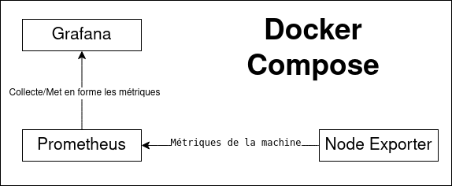
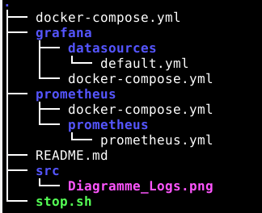
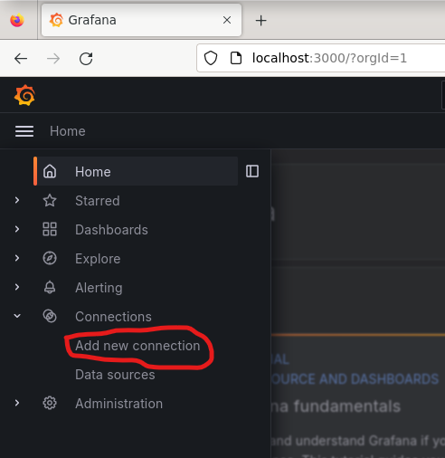

# SAE51_logs
#### Arno Djenadi - Gaëtan Kermarrec

## Travail à effectuer

- Produire un document de synthèse en Markdown présentant les solutions libres existantes de collecte, centralisation et présentation de logs. Vous donnerez leurs points-clés (features, communauté
associée, etc.) et leurs avantages et inconvénients respectifs. Vous vous intéresserez notamment
aux possibilités de centralisation (collecte des logs issus de plusieurs conteneurs/machines), à la
facilité d’utilisation et d’installation, et aux possibilités offertes par les "dashboard".

- Produire un Dockerfile qui met un oeuvre une situation simple de collecte de logs, basée sur une
des solutions existantes. Le lancement du (des ?) conteneur(s) doit permettre de se faire une idée
des possibilités, via une doc associée, rédigée en Markdown.

## Nos échecs

- Dans un premier temps, nous avons tenté de récupérer les logs d'une page web réalisé par nos soins mais nous avons réalisé que Node Exporter collete initialment les métriques de la machine.
- Dans une second temps, nous avons tenté de crée notre docker à partir d'un script bash. Mais nous n'avons pas trouver les comment mettre en place les solutions attendues.
- Pour finir, Lors de la configuration du graphana nous nous sommes trompé de source en indiquant **node-exporter:9100** au lieu de **localhost:9100**

## Solutions 

Nous avons finallement choisis de d'utilisé Node Exporter qui récupere les métriques de la machine au lieu d'utilisé NGINX pour allèger notre rendu.

**Node Exporter** : Cet outil collecte des métriques sur la machine.Il fournit des informations sur l'utilisation du CPU, de la mémoire, du disque,etc...

**Prometheus** : Cet outil interroge régulièrement Node Exporter pour collecter les données et les stocke dans une base de données

**Graphana** : Cet outil de visualisation nous permet de créer des tableaux de bord interactifs basés sur les données collectées par Prometheus.

## Mise en place

Pour la mise en place, avec le fichier ZIP, il faut unzip le fichier ce qui va donner une arborescence comme celle-ci :

Une fois que nous avons bien unzip le fichier il faut se placer à la racine.
Pour lancer la totalité des conteneurs il faut faire cette commande :
> docker compose up -d

L'argument -d sert à se détacher des conteneurs et donc garder la main sur son terminal.

Une fois cela fait il faut se rendre sur cette adresse :
> localhost:3000

Le port 3000 étant celui de grafana.

Une fois sur la page il faut se connecter les identifiants sont ceux de base donc : 
Dans "email or username" : admin
Dans "Password" : admin
Puis skip le changement de mot de passe.

Une fois bien connecté ouvrir le menu sur le côté aller dans connections puis add new connection :

